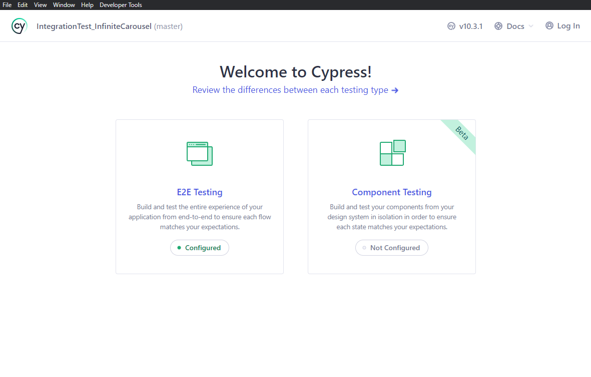
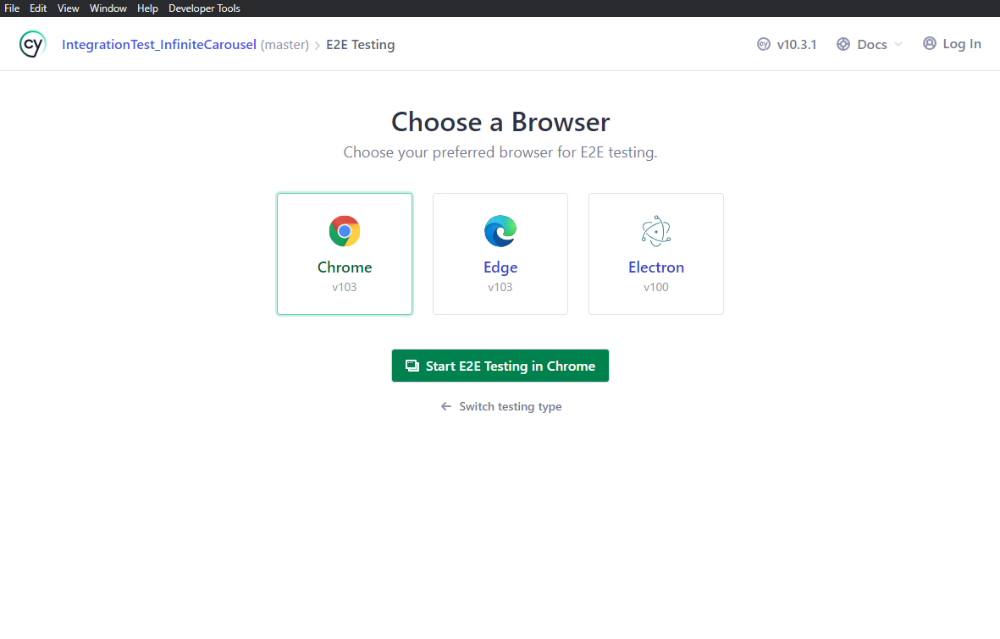
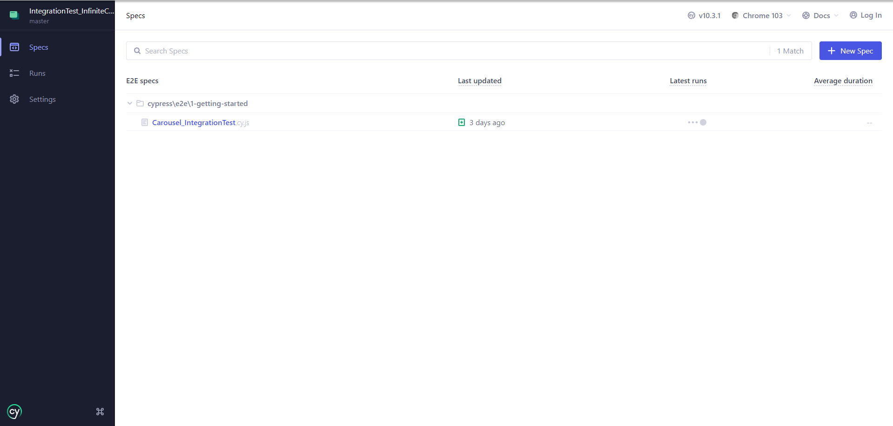
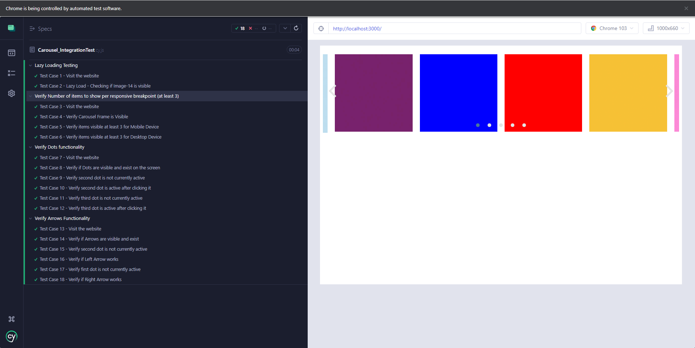

# **Cypress Integration Testing of React_Leaf_Carousel**
Testing React Carousel Component using Cypress Automation Testing tool. Repository contains files related to testing the React Carousel using Cypress and React carousel component.

**Setup Up Cypress 10.3.1**
**Any Version of Cypress older then 10 will have .spec.js extension while newer versions have .cy.js extension**

## **Pre-requisities**
* Browser (Chrome)
* React.js
* Cypress (veriosn 10 or above) - Integration Testing
* Visual Studio Code - IDE 
> codesandbox.io does not provide environment for cypress based integration testing.
* **
## Bug Logging
#### Image links should be updated as the provided links in the example are not responding
##### Description
Images in the Infinite Carousel are not loading due to image link are not responding. This may be due to image website removing the image or possibly website shut down. Updating the image links would resolve this problem. In the provided screenshot, images are not visible but Arrows and Dots are visible.
> Screenshot

##### Steps
* Visit baseURL - http://localhost:3000/
* Wait for Dots and Arrows to Appear
* Images will not appear in the Infinite Carousel Component due to not responding

##### Environment 
Staging
* **

## **Exercise 3**
### Task 1 - Environment Setup
* Clone this repository in local folder. https://github.com/itsDaniyaL/cypress_integrationtest.git
* In terminal, `npm install` to install all dependencies related to integration testing(cypress.io).
* In terminal, `npm start` to setup development environment and start server. 
* In terminal, `npx cypress open` to open Cypress Window.
* Select e2e testing -> Chrome(or any other desired browser). A new tab will open in the browser.

* Select 'InfiniteCarousel_IntegrationTesting.cy.js' to run integration test.

### Teak 2 - Integration Tests
* **Before Each Test, I visited the website.**
* **Updated the image links as original links are not responding. Original image links are commented and are within the index.js file.**
##### **Lazy Loading**
Tested lazy loading of an image(image-14) by first, verifying image does exist and has 1 length(check for duplication) and is currently not visible. Second, slide the carousel to make image-14 visible and verified if image is indeed visible.
> As all the images are instantly loaded within 500 milliseconds. It is only possible to test image existence and by sliding the carousel to verify if image is visible now.  
##### **Number of items to show per responsive breakpoint (at least 3)**
Verified number of items visible per responsive breakpoint for mobile and desktop devices. Changed viewport width and height to verify if atleast 3 images are visible on the screen.
##### **Arrows and Dots Functionality**
#####  Testing Dots Functionality
Verified if dots are visible. If device's display is horizontaly long, dot(s) may not appear. Hence, have to test if dots are visible.
Checked if Second Dot is currently not active. If true, clicked the second dot and checked if the seoncd dot is now active. Performed same test for third dot.
**Have to wait 500 millisceonds/0.5 seconds before clicking as sliding animations takes 500 milliseconds to complete.**

##### Testing Arrows Functionality
Verified if dots and arrows are visible and exist.
Checked if Second Dot is currently not active. If true, clicked the next arrow(Right Arrow) and checked if second dot is now active. Performed same for prev arrow(Left Arrow).
**Have to wait 500 millisceonds/0.5 seconds before clicking as sliding animations takes 500 milliseconds to complete.**

